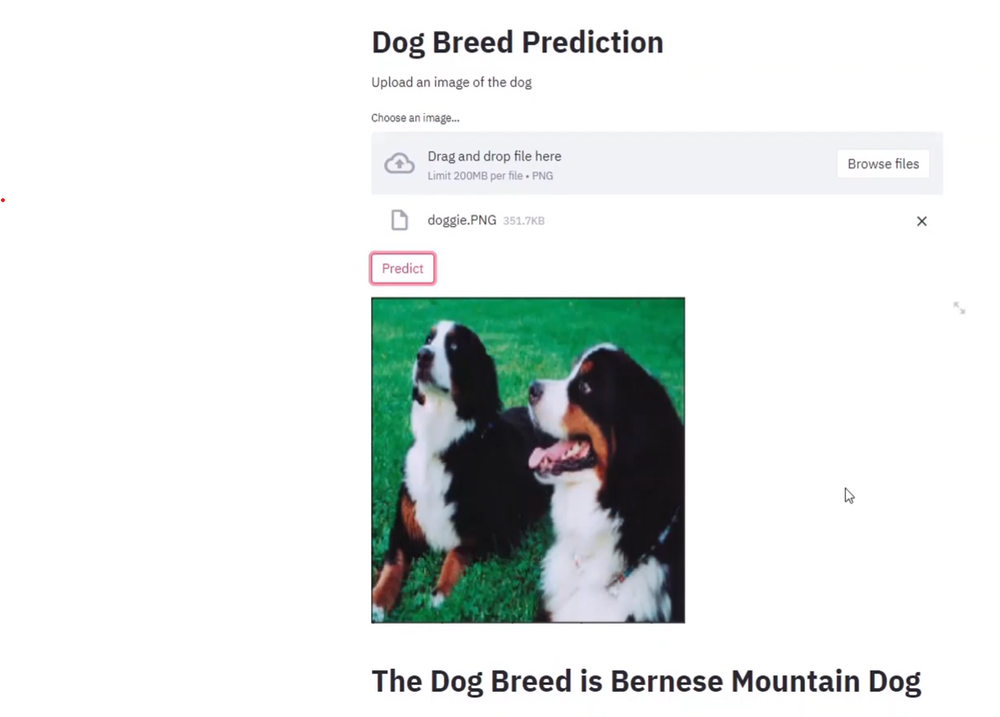

# Dog_Breed_Prediction
In this project, we will see how to use Keras and TensorFlow to build, train, and test a Convolutional Neural Network capable of identifying the breed of a dog in a supplied image. This is a supervised learning problem, specifically a multiclass classification problem. We started with downloading the dataset creating the model and finding out the predictions using the model. We can optimize different hyper parameters in order to tune this model for a higher accuracy. This model can be used to predict different breeds of dogs which can be further used by different NGO's working on saving animals and for educational purposes also.
THE STEPS : 
1. LOADING THE DATA FROM KAGGLE.
2. LOAD LABELS CSV FOR LABELS THAT CONTAIN IMAGE ID AND BREED.
3. CHECKING THE BREED COUNT.
4. ONE-HOT ENCODING ON LABELS DATA PREDICTION COLUMN.
5. LOAD THE IMAGES, CONVERT THEM TO AN ARRAY, AND NORMALIZE THEM.
6. CHECKED THE SHAPE AND SIZE OF THE X AND Y DATA.
7. BUILDING THE MODEL NETWORK ARCHITECTURE.
8. SPLIT THE DATA AND FIT IT INTO THE MODEL AND CREATE AN ACCURACY PLOT.
9. EVALUATE THE MODEL FOR ACCURACY SCORE.
10. USING THE MODEL FOR PREDICTION.

